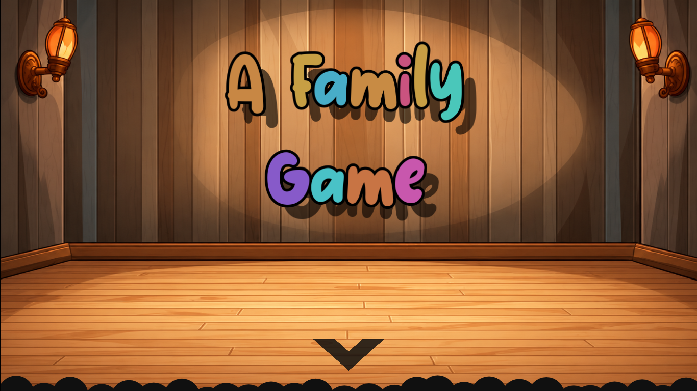
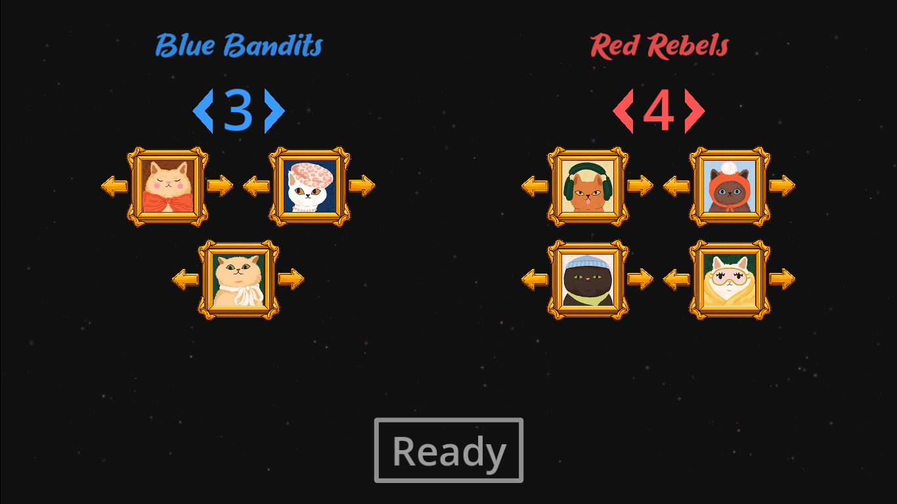
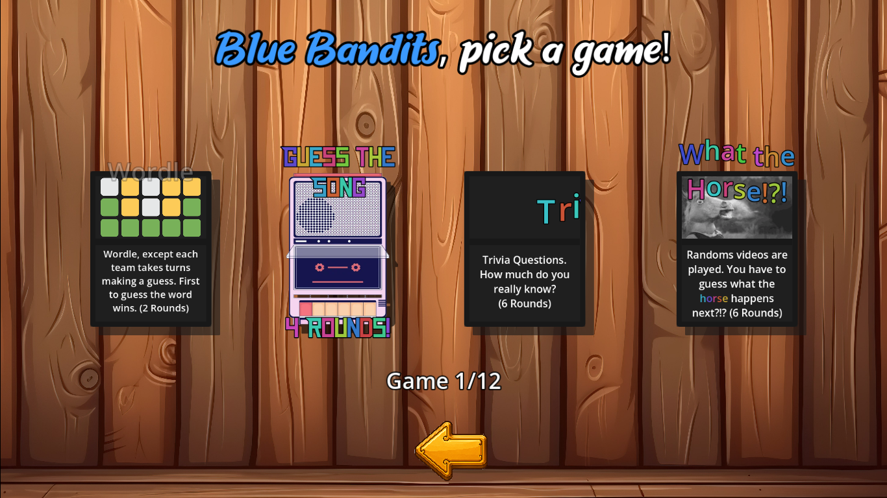
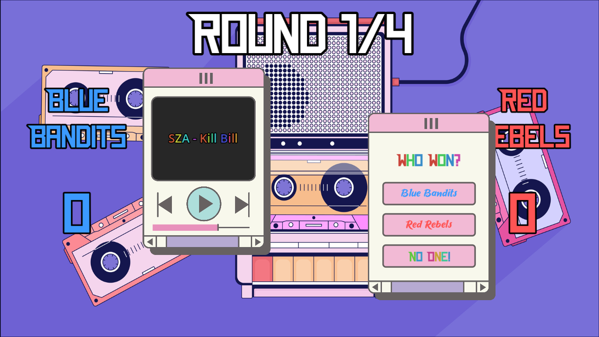
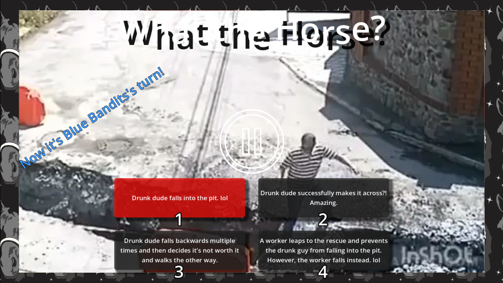
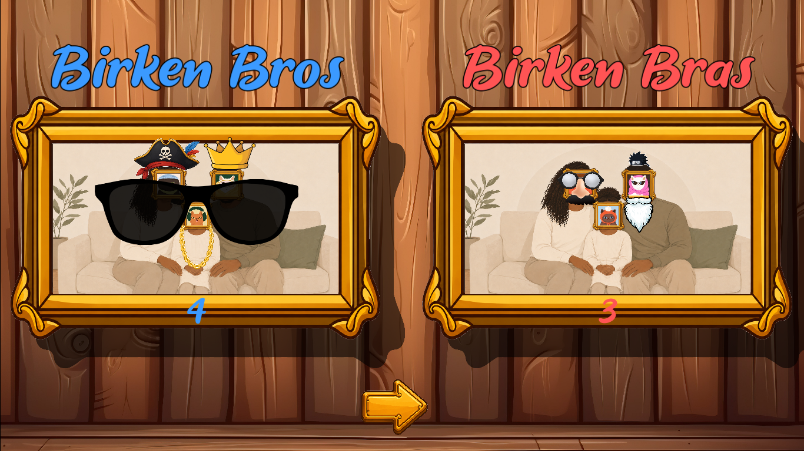

# A Family Game

A local two-team party game built in **Godot 4.6** for playing with family and friends.

Players split into two teams, create a family portrait, and compete across a collection of minigames. Winning games earns opportunities to customize the team's portrait with silly accessories such as hats, glasses, crowns, and more.

  

## Gameplay

Each team chooses its players and family portrait before taking turns selecting minigames.

  
  

The current game includes four minigames:

- **Guess the Song** — listen to a song clip and compete to identify it.
- **Trivia** — answer randomized trivia questions.
- **Word Game** — a team-based word guessing game inspired by Wordle.
- **What the Horse?!** — watch part of a video, pause before the ending, and guess what happens next.

  
  

## Family Portraits

The main game ties the minigames together through each team's family portrait. Winning gives teams a chance to decorate their portrait with accessories, so the portraits become increasingly ridiculous as the game continues.

  

## Project Highlights

- Built as a **solo project** in Godot using GDScript.
- Shared game state tracks team names, scores, player portraits, and minigame progress.
- Separate scenes and scripts organize the four minigames and menu flow.
- Song, trivia, and video content is loaded from external data files, making rounds easy to swap or extend.
- Includes audio/video playback, randomized content selection, animated UI transitions, team scoring, and persistent portrait customization.

## Running the Project

1. Install **Godot 4.6**.
2. Clone this repository.
3. Import `project.godot` into Godot.
4. Run the project.

The game is designed for **local play on a shared screen**.

## Media

The game was originally created for private play with family and friends. Song and video content is designed to be replaceable through the files under `game_data/`.

## About

This was my first solo game project. I built it as a way to learn Godot while making something that could actually be played at family gatherings and with friends.
